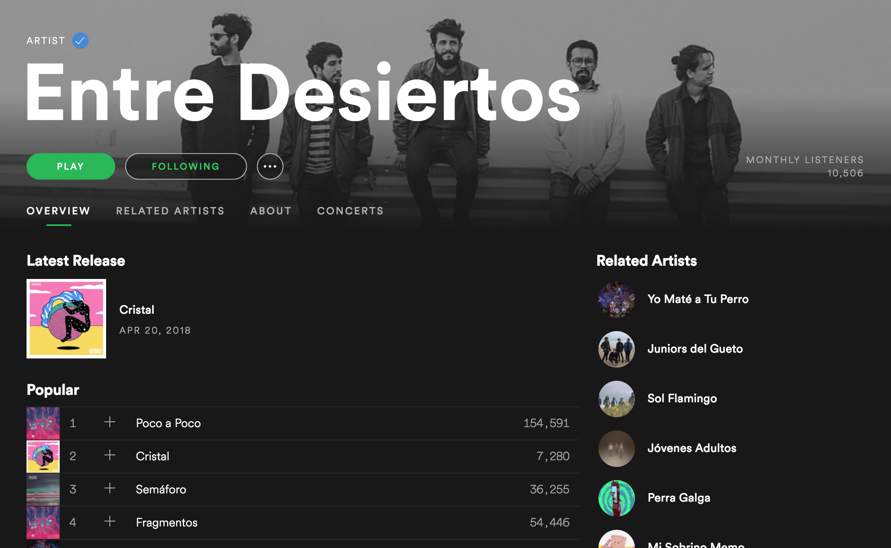
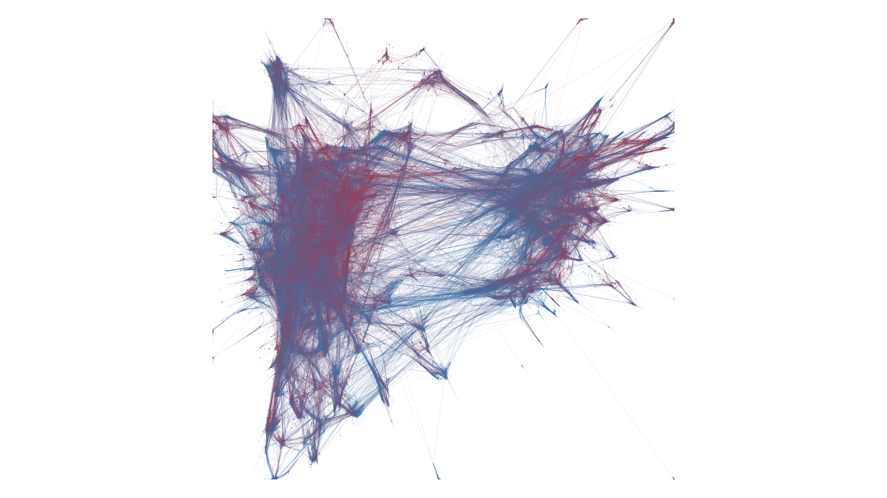
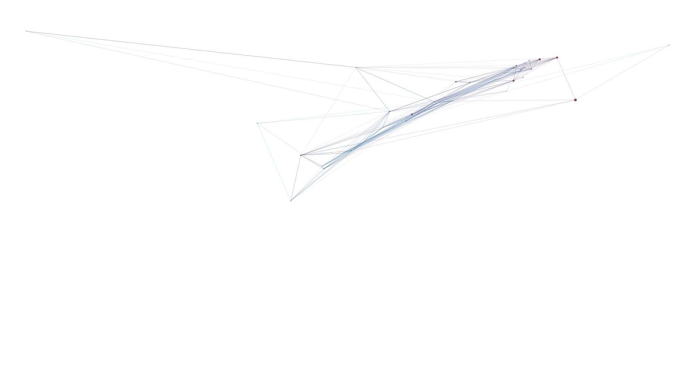
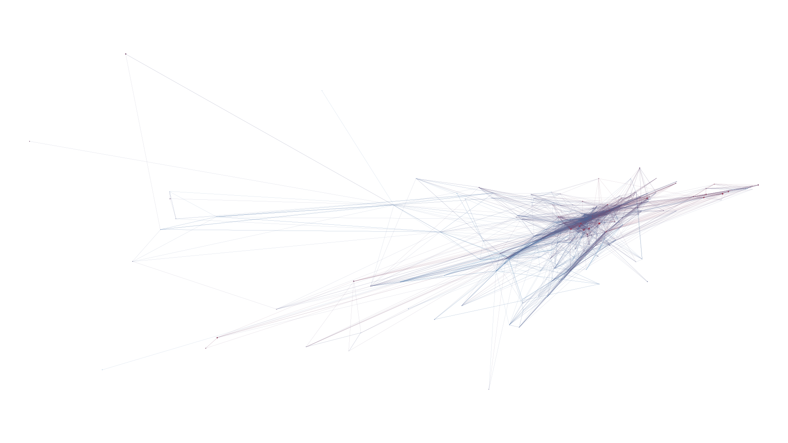
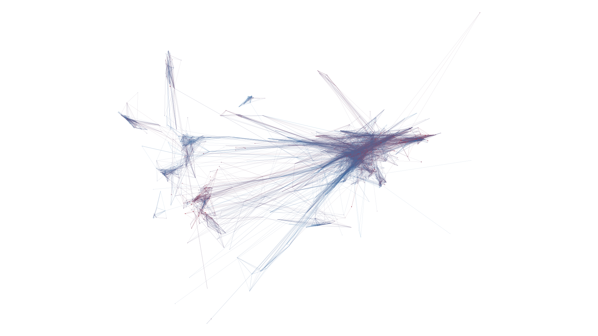

# artistcloud

One of Spotify's most interesting features is the 'Related artists' information it gives about a given artist.

In this example, we can see that the artist *Entre Desiertos* is related to *Yo Maté a Tu Perro*, *Juniors del Gueto*,
*Sol Flamingo*, among others. But what if we want to make a more thorough search? Say, get each of an artist's related artists, and then
get each of those related artists's related artists's, and so on. Thanks to artistcloud, that's possible.

# How to use

artistcloud is a program based on the Spotify API. Note that you'll need to have Python 3 installed on your computer in order
for it to run.

1. Type `python artistcloud.py` on your Terminal
2. Search for an artist
3. Define the graph size
4. You'll get two CSV files, *nodes.csv* and *edges.csv*
5. Import the files to a plotter, such as Gephi

# Examples

*Generated artist graph: 44,896 artists, 370,457 connections*

*Entre Desiertos's related artists (1st degree)*

*Entre Desiertos's related artists (2nd degree)*

*Entre Desiertos's related artists (3rd degree)*

# To do
- [ ] Define a graph search method
- [ ] Create a GUI for the program

# Useful links
- (Spotify Web API documentation)[https://beta.developer.spotify.com/documentation/web-api/]
